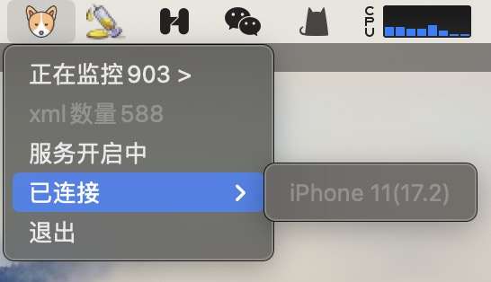
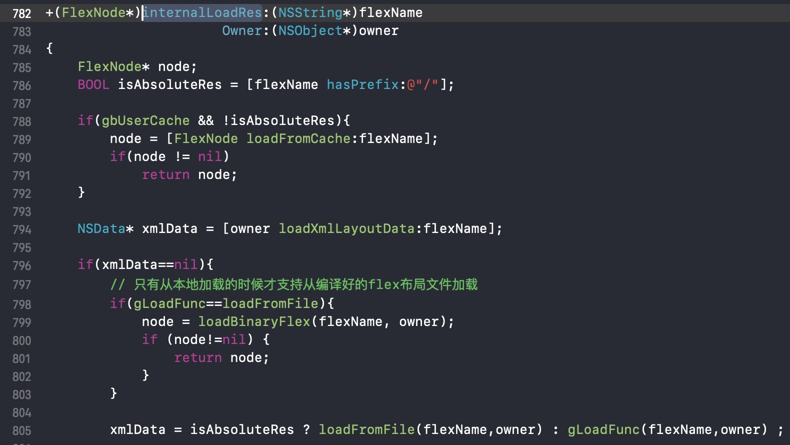
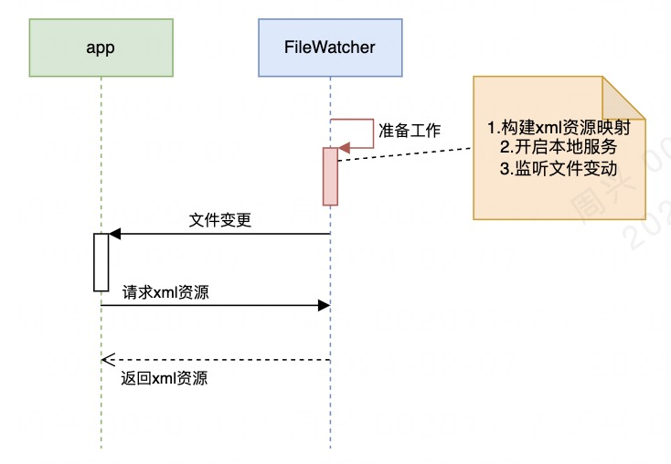
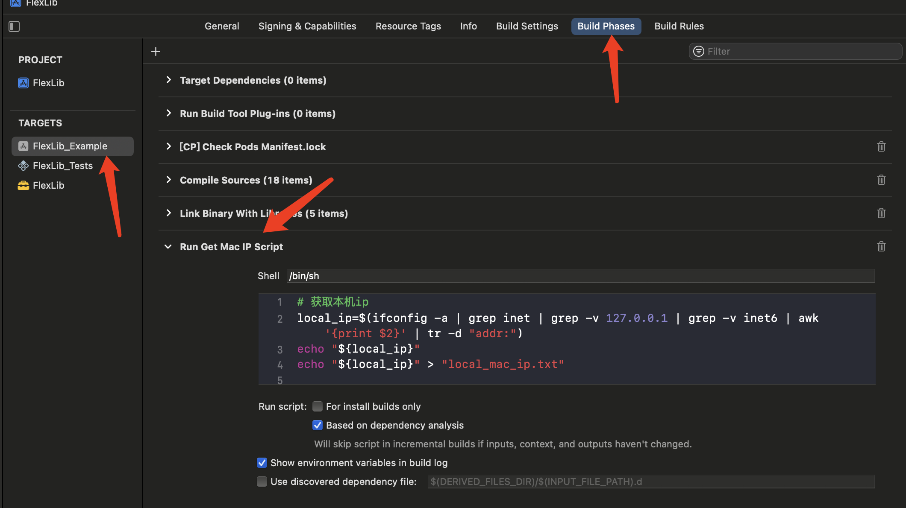
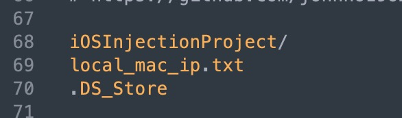
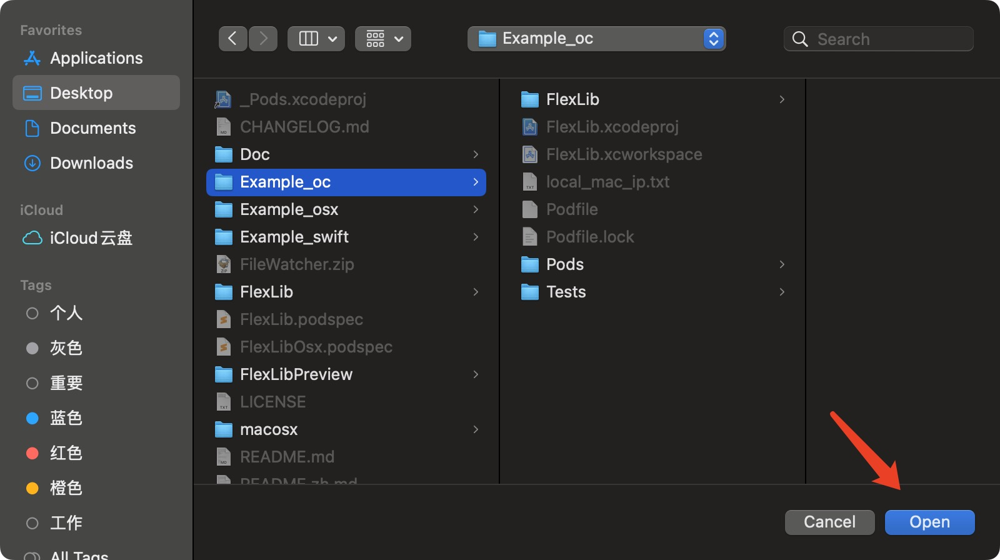
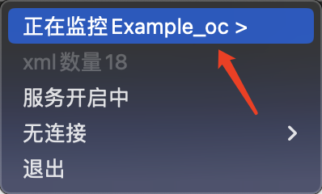
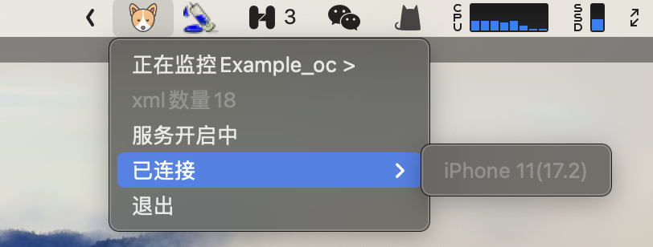

# FlexHotReload

[](https://img.shields.io/badge/Language-%20Objective--C%20-orange.svg)


[](https://github.com/Carthage/Carthage)

[FlexLib](https://github.com/zhenglibao/FlexLib)作为一个现代化的UI框架，为我们写UI及布局提供了很大的便捷。如果能够在debug环境下实时访问本地xml文件，修改了xml后只要再重新访问这个资源，就能基于最新的xml进行UI渲染，这样就能够在不重新编译的情况下看到最新的修改，进而提高开发效率。

`FlexHotReload` 是一个为[FlexLib](https://github.com/zhenglibao/FlexLib)提供了一个更加简单高效的热重载能力的框架。虽然FlexLib提供了hotPreview能力，但实际开发场景中xml一般都需要配合其容器vc或view等进行业务数据的更新和呈现，结合xml所在容器，进行xml的热重载，更加符合实际业务开发场景。

## 原理

热重载能力依赖mac端程序[FileWatcher](https://github.com/zhouxing5311/FileWatcher)。FileWatcher提供对xml资源的文件变动监听、通过http服务的形式访问xml、以及获取指定目录下的xml资源。

 

FlexLib在构建视图树时，加载xml资源的代码逻辑在`internalLoadRes:Owner:`方法中。`FlexHotReload` 核心思想就是hook该加载方法，让该方法在本地xml服务资源可用时加载该服务资源，从而实现热重载的能力。


流程图简单表示如下：



## 使用方法

### 源码或pod依赖

```
pod 'FlexHotReload', '~> 0.0.1'
```

### 配置本机ip获取方式

#### 方式1：自动获取（推荐）

在当前运行target下的build phases下增加获取当前macip的脚本



```shell
# 获取本机ip
local_ip=$(ifconfig -a | grep inet | grep -v 127.0.0.1 | grep -v inet6 | awk '{print $2}' | tr -d "addr:")
echo "${local_ip}"
echo "${local_ip}" > "local_mac_ip.txt"
```

将`local_mac_ip.txt`拖入主工程中，作为main bundle的资源（FlexHotReload通过main bundle访问他获取ip）


将`local_mac_ip.txt`添加到.gitignore文件中，



#### 方式2：手动指定（可能会带来多人协作代码提交问题）

在app启动第一时间来指定当前服务的ip地址

```objective-c
[FlexHotReloadUtil updateServerIP:@"10.252.10.1"];
```


### 开启FileWatcher

下载[FileWatcher](https://github.com/zhouxing5311/FileWatcher)，将其拖到Applications中，打开后指定其监控目录。



### 编译工程
上面的流程配置好后就可以开始编译工程了。首次编译成功后打开app可能会有以下提醒，允许后再次编译即可。


当状态栏中的FileWatcher变为黄色，显示有设备连接即为配置成功。


此时可查看控制台输出，若有类似打印，则说明配置成功。相关日志可通过`[FHR]`前缀过滤。
```
[FHR]：Connect to server ok
[FHR]：发送消息：iPhone 11(17.2)
[FHR]：flex use local xml：http://10.252.10.202:8000/Test/Views/TestView.xml //使用在线资源
[FHR]：flex use cache xml：TestView.xml //使用内存缓存，文件无变动时加快响应速度
[FHR]：收到消息：/Users/zhouxing/Desktop/code/Test/TestView.xml //发现文件变更，下次请求该xml会重新走在线资源
```

## 使用效果
查看视频：[视频地址](https://github.com/zhouxing5311/FlexHotReload/raw/main/images/demo.mp4)

## 注意事项

- 热重载能力目前只在debug模式下生效，可能会影响xml页面首次加载速度（xml有了缓存之后会和未开启热重载加载速度一致）

- 当编辑完xml后记得先command+s保存当前xml，让FileWatcher监听到xml变动，这样重新加载该xml时就能使用最新的资源了（状态栏图标会短暂变绿并变回黄色）

- 目前FileWatcher开启后会占用localhost的8000端口（后期增加自定义端口能力）

- 可通过控制台过滤[FHR]，进行热重载相关日志的查看

- 当网络发生变动时app与FileWatcher之间的链接会中断，建议通过AFN等手段增加以下网络监控方法，网络变动时进行updateMacIpNormal方法调用。方法内部会重新更新ip是否可用以及重连socket

```objective-c
//监听网络状态
[[NSNotificationCenter defaultCenter] addObserver:self selector:@selector(networkStatusChangeAcion) name:AFNetworkingReachabilityDidChangeNotification object:nil];


- (void)networkStatusChangeAcion {
    AFNetworkReachabilityStatus status = [AFNetworkReachabilityManager sharedManager].networkReachabilityStatus;
    
    switch (status) {
        case AFNetworkReachabilityStatusReachableViaWiFi: {
            //wifi连接后更新状态
            [[FlexSocketManager sharedInstance] updateMacIpNormal];
            break;
        }
        case AFNetworkReachabilityStatusReachableViaWWAN: {
            //4g网络
            [FlexSocketManager sharedInstance].connectToMapIpNormal = NO;
            break;
        }
        case AFNetworkReachabilityStatusNotReachable: {
            //断网
            [FlexSocketManager sharedInstance].connectToMapIpNormal = NO;
            break;
        }
        case AFNetworkReachabilityStatusUnknown: {
            //网络状态未知，尝试连接localhost
            [[FlexSocketManager sharedInstance] updateMacIpNormal];
            break;
        }
        default: {
            break;
        }
    }
}
```